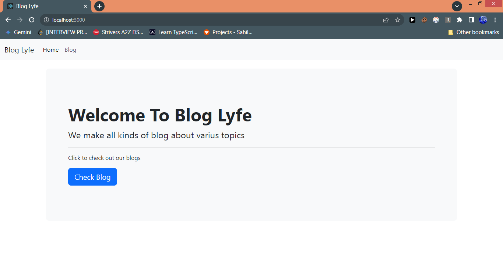
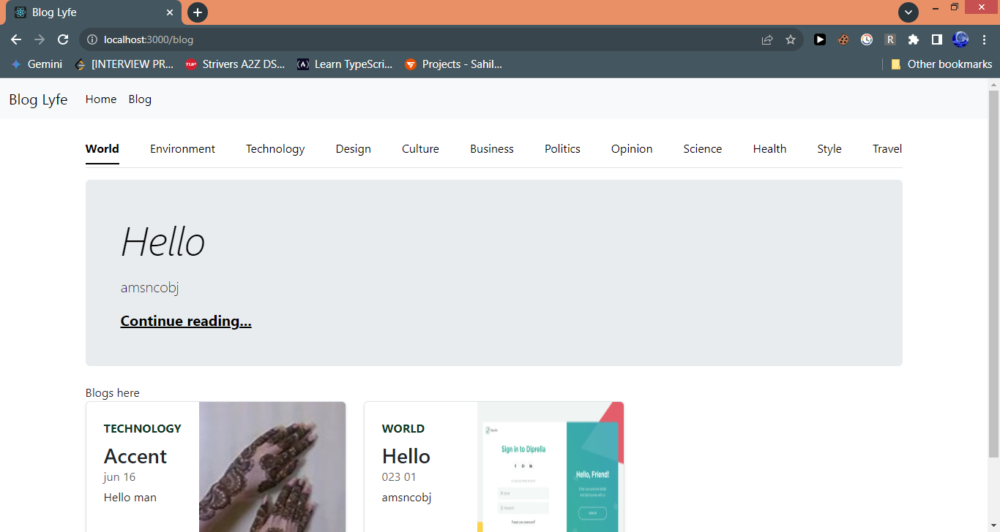
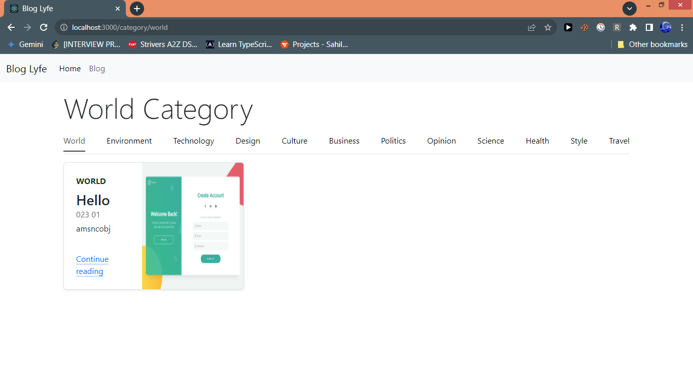

# react-blog

**A full-stack blog application built with React (frontend) and Django (backend/API).**

**Features:**

- User-friendly navigation with categorized blog posts.
- Modern web technologies for a responsive and performant experience.

## Screenshots





**Configuration:**

**1. Django:**

- Configure settings (database, secret key, etc.) in `settings.py`.
- Configure URLs in `urls.py` to point to your React app's build output directory.

**2. React:**

- Create a `.env` file to store any sensitive environment variables (e.g., API endpoint URLs).
- Update configuration values in React code if necessary (e.g., API base URL).


# Start Code

**Getting Started**

**Prerequisites:**

- Node.js and npm (or yarn) installed.
- Python and pip installed.

**Installation:**

1. Clone the repository: `git clone https://github.com/akhtarmdsaad/react-blog.git`
2. Navigate to the project directory: `cd react-blog`
3. Copy and paste the following command into terminal:
```
pip install django
pip install django-cors-headers
pip install djangorestframework
pip install djangorestframework-simplejwt
pip install django-summernote
cd frontend
npm install
```
This command will install all the necessary files required to run the project. **Make sure you are connected to Internet**

### Run Backend Server
Open a terminal and paste the following code:
```
cd backend
python manage.py makemigrations
python manage.py migrate
python manage.py runserver
```

### Run Frontend Server
Open another terminal and paste the following code:
```
cd frontend
npm start
```
